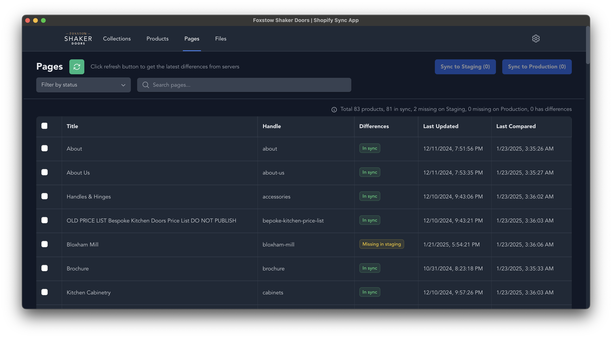

# User Guide for Shopify Sync App

## Table of Contents

1. [Introduction](#introduction)
2. [Navigating the Dashboard](#navigating-the-dashboard)
3. [Managing Settings](#navigating-the-dashboard)
4. [Managing Collections](#managing-collections)
5. [Managing Products](#managing-products)
6. [Managing Pages](#managing-pages)
7. [Managing Files](#managing-files)
8. [Syncing Data](#syncing-data)
9. [Conclusion](#conclusion)

---

## Introduction

Welcome to the Shopify Sync App. This guide will help you navigate the various sections of the platform, including Collections, Products, Pages, and Files.

## Navigating the Dashboard

Upon logging in, you will see the main dashboard with tabs for **Collections**, **Products**, **Pages**, **Files** and also **Settings**. Each tab provides access to different aspects of the management system.

## Managing Settings

### Overview

The app requires Shopify Admin API access tokens for both staging and production environments. This section allows you to configure additional sync settings.

### Option:

- **Store URL**: The store full API url. For example: https://the-store.myshopify.com/admin/api/2024-10/graphql.json.
- **Access Token**: The token that is generated for API access. This token can be generated in Shopify admin dashboard -> Settings -> Apps and sales channel -> Develop apps section. **Note**: Please make sure the following API access scopes are included: `write_products, read_products, write_product_feeds, read_product_feeds, read_product_listings, write_product_listings, write_online_store_pages, read_online_store_pages, write_content, read_content, read_files, write_files, read_themes`
- **Sync product images when syncing products**: Check this box if you want to sync product images along with other product data.

## Saving Settings

After configuring the production and staging environments:

1. Click the **Save Settings** button at the bottom of the Settings Page.
2. A confirmation message will appear, indicating that your settings have been saved successfully.

## Conclusion

This user guide provides an overview of the Settings Page for the Shopify Sync App. By following the instructions outlined in this guide, you can effectively configure the app to sync data between your Shopify environments.

## Managing Collections

### Overview

The Collections tab allows you to view and manage different product collections.

### Key Features

- **Filter by Status**: Use the dropdown to filter collections based on their sync status.
- **Search Collections**: Enter keywords to find specific collections.

### Example

- **Title**: Displays the name of the collection.
- **Handle**: Shows the unique identifier for the collection.
- **Differences**: Indicates if the collection is in sync.
- **Last Updated**: Displays the last update timestamp.
- **Last Compared**: Shows when the collection was last compared.

> [!IMPORTANT]  
> It is very important to make sure all the products are synced to the target environment before sync any collection. If a particular product does not exists in the target environment, it will cause the collection sync fail as the app will fail to locate the product.

## Managing Products

### Overview

The Products tab allows you to manage individual products within your collections.

### Key Features

- **Filter by Status**: Similar to Collections, you can filter products based on their sync status.
- **Search Products**: Quickly find products using the search bar.

### Example

- **Title**: Name of the product.
- **Handle**: Unique identifier for the product.
- **Differences**: Indicates sync status.
- **Last Updated**: Timestamp of the last update.
- **Last Compared**: Timestamp of the last comparison.

## Managing Pages

### Overview

The Pages tab allows you to manage static pages on your website.

### Key Features

- **Filter by Status**: Filter pages based on their sync status.
- **Search Pages**: Use the search bar to find specific pages.

### Example

- **Title**: Name of the page.
- **Handle**: Unique identifier for the page.
- **Differences**: Indicates sync status.
- **Last Updated**: Timestamp of the last update.
- **Last Compared**: Timestamp of the last comparison.

## Managing Files

### Overview

The Files tab allows you to manage images and other files associated with your products and pages.

### Key Features

- **Filter by Status**: Filter files based on their sync status.
- **Search Files**: Quickly find files using the search bar.

### Example

- **File Name**: Name of the file.
- **Alt Text**: Descriptive text for the file.
- **Differences**: Indicates sync status.
- **Last Updated**: Timestamp of the last update.
- **Last Compared**: Timestamp of the last comparison.

## Syncing Data

### Overview

You can sync your data to ensure that all collections, products, pages, and files are up to date.

### Sync Options

- **Sync to Staging**: Sync changes to the staging environment.
- **Sync to Production**: Sync changes to the live environment.

### Example

## Conclusion

This user guide provides an overview of the Shopify Sync app. By following the instructions outlined in this guide, you can effectively manage collections, products, pages, and files within the platform. For further assistance, please contact support.
